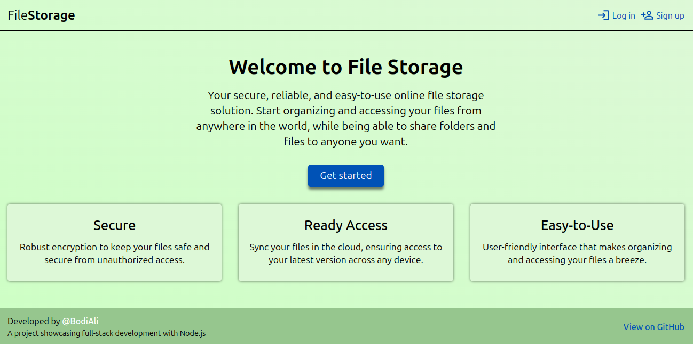

<h1 align="center">File Uploader</h1>

Stripped down version of Google Drive (or any other personal storage service).

<h3>Built with</h3>

- Express.js
- Prisma ORM
- Passport.js
- EJS
- connect-flash
- express-session
- Sentry
- node-cron

<h3>Features</h3>

- Session‑based authentication with Passport.js, allowing users to sign up, log in, and maintain secure access throughout their
  session.
- An intuitive folder and file management features—create, read, update, delete—backed by Prisma’s ORM for reliable data modeling.
- Users can upload files, allowing them to sign in again from any other device and download or view their files.
- Share‑folder functionality that generates expiring links, letting even unauthenticated users access content for a configurable duration.
